# McpLand

McpLand is a TypeScript framework for building and managing **Model Context Protocol (MCP) tools** with embedded context search capabilities. It provides a unified platform for creating AI-powered tools that can fetch, process, and search contextual information from various sources.

# Installation

```bash
bun install -g mcpland
```

# Usage

```bash
mcp init
```

```bash
mcp link cursor
```

# Architecture



## Data Flow

1. 📥 Context Ingestion
   `External Source → Fetcher → Chunker → Embedder → SQLite Store`

2. 🔍 Query Processing  
   `LLM Query → MCP Server → Tool Handler → Vector Search → Ranked Results`

3. 📤 Response Generation
   `Search Results → Context Assembly → MCP Response → LLM Client`


## Technical Features

### Embedding-Powered Search
- **Semantic search** capabilities beyond keyword matching
- **Relevance scoring** with configurable limits
- **Source isolation** for multi-context environments

### Plugin Architecture
- **Auto-discovery** of MCP implementations
- **Tool registration** with validation
- **Modular design** for easy extension

### Production Ready
- **Comprehensive testing** with Vitest
- **Type safety** throughout with TypeScript
- **Error handling** and logging


## MCP Creation
```typescript
// Create new MCP in src/mcps/your-mcp/
class YourMCP extends McpLand {
  constructor() {
    super({ name: 'your-mcp', description: 'Your description' });
  }
}

// Create tools in src/mcps/your-mcp/tools/
class YourTool extends McpTool {
  async fetchContext(): Promise<string> {
    // Fetch your context
  }
  
  async handleContext(args: unknown): Promise<ServerResult> {
    // Handle search queries
  }
}
```

## Integration Points
- **Cursor IDE integration** via link command
- **Multiple LLM clients** via MCP protocol
- **External APIs** and local files as context sources
- **Custom embedding models** and search algorithms

# Roadmap

- [ ] Add ability to serve SSE requests
- [ ] Add ability to schedule context updates
- [ ] Add ability to link with cursor globally
- [ ] Add ability scaffold new mcps

# License

MIT